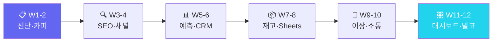

<div align="center">

# 🛒 소매·이커머스 AX 마스터클래스

### "AI로 상품 노출부터 재구매까지 설계하는 12주 이커머스 자동화"

**상품카피·SEO·CRM·이상감지 — 스마트스토어 데이터로 직접 검증**

[](https://github.com/Reasonofmoon/hexa-3)
[](https://github.com/Reasonofmoon/hexa-3/tree/main/notebooks)
[](https://github.com/Reasonofmoon/hexa-3)
[](https://aistudio.google.com/)
[](LICENSE)

> **"스마트스토어 키워드 최적화, 상품설명 작성, 리뷰 관리... 매일 3~4시간이 사라진다." 이 과정이 끝나면 자동화됩니다.**

[🚀 W1 바로 시작](https://colab.research.google.com/github/Reasonofmoon/hexa-3/blob/main/notebooks/W01_retail_diagnosis.ipynb) · [📂 전체 노트북](notebooks/) · [🔧 CLI 스크립트](scripts/) · [🐛 이슈](../../issues)

</div>

---

## 🧠 Philosophy — "왜 소매/이커머스 AX인가"

기존 AI 교육의 문제: **이론만 있고 현장 데이터가 없다**.

| 기준 | 기존 AI 교육 | 소매·이커머스 AX 마스터클래스 |
|------|-------------|---|
| 데이터 | 가상의 샘플 데이터 | **소매/이커머스 현장 CSV** |
| 결과물 | 모델 정확도 숫자 | **경영진 보고서 + 자동화 파이프라인** |
| 난이도 | Python 필수 | **Colab 실행만으로 완성** |
| 기간 | 3개월+ 이론 | **W1부터 당일 실전 결과** |
| 연결성 | 개별 실습 | **W1→W12 자동화 파이프라인** |



---

## ⚙️ 12주 커리큘럼

### Layer 1 · Foundation (W1~W4) — AI 기초 도구화

> **Wow**: 상품 5개의 배달앱 설명·인스타 캡션 **30초** 내 자동 생성

| 주차 | 주제 | 핵심 출력물 | Colab |
|----|------|------------|-------|
| **W1** | 이커머스 AX 자가진단 | 10항목 레이더 · 디지털 전환 로드맵 | [](https://colab.research.google.com/github/Reasonofmoon/hexa-3/blob/main/notebooks/W01_retail_diagnosis.ipynb) |
| **W2** | 상품 카피 자동화 | 배달앱 타이틀·상세설명·키워드5개 ZIP | [](https://colab.research.google.com/github/Reasonofmoon/hexa-3/blob/main/notebooks/W02_retail_product_copy.ipynb) |
| **W3** | SEO 키워드 분석 | 핵심 키워드 10개 + 롱테일 5개 리포트 | [](https://colab.research.google.com/github/Reasonofmoon/hexa-3/blob/main/notebooks/W03_retail_seo_analysis.ipynb) |
| **W4** | 채널별 매출 비교 | 스마트스토어·쿠팡 채널 전략 보고서 | [](https://colab.research.google.com/github/Reasonofmoon/hexa-3/blob/main/notebooks/W04_retail_channel_analysis.ipynb) |

### Layer 2 · Analytics (W5~W8) — 데이터 기반 의사결정

> **Wow**: 30일치 판매 데이터로 **이상 판매일 자동 감지** (3σ 기준)

| 주차 | 주제 | 핵심 출력물 | Colab |
|----|------|------------|-------|
| **W5** | 매출 예측 & 트렌드 | 14일 rolling 예측 · 라인차트 PNG | [](https://colab.research.google.com/github/Reasonofmoon/hexa-3/blob/main/notebooks/W05_retail_sales_forecast.ipynb) |
| **W6** | CRM 고객 세분화 | RFM 3분류 · 이탈위험 맞춤 메시지 | [](https://colab.research.google.com/github/Reasonofmoon/hexa-3/blob/main/notebooks/W06_retail_crm.ipynb) |
| **W7** | 재고 알림 자동화 | 부족 상품 감지 · 발주 문자 자동 생성 | [](https://colab.research.google.com/github/Reasonofmoon/hexa-3/blob/main/notebooks/W07_retail_inventory_alert.ipynb) |
| **W8** | 매출 Sheets 연동 | Google Sheets 업로드 · CSV fallback | [](https://colab.research.google.com/github/Reasonofmoon/hexa-3/blob/main/notebooks/W08_retail_sales_sheets.ipynb) |

### Layer 3 · Intelligence (W9~W12) — 자동화 운영 시스템

> **Wow**: RFM 분층으로 VIP·이탈위험 고객 구분 → 맞춤 메시지 즉시

| 주차 | 주제 | 핵심 출력물 | Colab |
|----|------|------------|-------|
| **W9** | 판매 이상 감지 | 3σ 기법 · 이상치 2건 보장 · 경보메시지 | [](https://colab.research.google.com/github/Reasonofmoon/hexa-3/blob/main/notebooks/W09_retail_sales_anomaly.ipynb) |
| **W10** | 공급업체 소통 | 품질·납기·발주 공문 3종 · ZIP | [](https://colab.research.google.com/github/Reasonofmoon/hexa-3/blob/main/notebooks/W10_retail_vendor_communication.ipynb) |
| **W11** | 소매 종합 대시보드 | 매출·재고·리뷰 4패널 · AI 인사이트 | [](https://colab.research.google.com/github/Reasonofmoon/hexa-3/blob/main/notebooks/W11_retail_overall_dashboard.ipynb) |
| **W12** | 12주 성과 발표 | KPI 비교 막대그래프 · 경영진 보고서 | [](https://colab.research.google.com/github/Reasonofmoon/hexa-3/blob/main/notebooks/W12_retail_12week_result_presentation.ipynb) |

---

## 🎯 수준별 활용 가이드

### 🟢 Starter — "5분 안에 첫 AI 결과"
> AX 진단점수 10~24점 · 코딩 경험 없음

1. [W1 노트북](https://colab.research.google.com/github/Reasonofmoon/hexa-3/blob/main/notebooks/W01_retail_diagnosis.ipynb) 클릭 → Google Colab에서 열기
2. `GEMINI_API_KEY` 입력 ([발급](https://aistudio.google.com/apikey))
3. 쇼핑몰명·플랫폼 입력 → AX 진단 레이더 차트
4. `Ctrl+F9` (전체 실행) → 결과 자동 다운로드

### 🔵 Professional — "실제 데이터로 실전 분석"
> AX 진단점수 25~39점 · 기초 Excel 가능

1. `shared/retail_products_sample.csv` 구조 확인
2. 상품 CSV 업로드 → 키워드 10개 + 카피 자동 생성
3. W7~W8에서 Slack/Sheets 연결
4. W9~W10으로 이상감지·소통 자동화 구축

### 🟣 Enterprise — "12주 파이프라인 & 팀 표준화"
> AX 진단점수 40~50점 · 자동화 확장 목표

1. W11 대시보드 → 채널별 KPI + Sheets 실시간 연동
2. W12 보고서를 정기 자동화 스케줄로 전환
3. 다른 hexa 시리즈와 교차 벤치마킹

---

## 🔧 확장 우선순위

| 우선순위 | 커스터마이징 | 난이도 | 영향 범위 |
|----------|--------------|--------|----------|
| **1st** | 쇼핑몰 정보 입력 | ⭐ | 브랜드·플랫폼 |
| **2nd** | 상품 CSV 실제 데이터 교체 | ⭐⭐ | 분석 전체 |
| **3rd** | 재고 알림 임계값 조정 | ⭐⭐ | 발주 자동화 |
| **4th** | Sheets API 연동 | ⭐⭐⭐ | 실시간 대시보드 |
| **5th** | W12 보고서 자동 스케줄링 | ⭐⭐⭐ | 경영진 자동 리포트 |

---

## 📂 프로젝트 구조

```
hexa-3/
├── notebooks/          ← 12주 Colab 실습 노트북 (W01~W12)
│   ├── W01_retail_diagnosis.ipynb                    # W1: 이커머스 AX 자가진단
│   ├── W02_retail_product_copy.ipynb                 # W2: 상품 카피 자동화
│   ├── W03_retail_seo_analysis.ipynb                 # W3: SEO 키워드 분석
│   ├── W04_retail_channel_analysis.ipynb             # W4: 채널별 매출 비교
│   ├── W05_retail_sales_forecast.ipynb               # W5: 매출 예측 & 트렌드
│   ├── W06_retail_crm.ipynb                          # W6: CRM 고객 세분화
│   ├── W07_retail_inventory_alert.ipynb              # W7: 재고 알림 자동화
│   ├── W08_retail_sales_sheets.ipynb                 # W8: 매출 Sheets 연동
│   ├── W09_retail_sales_anomaly.ipynb                # W9: 판매 이상 감지
│   ├── W10_retail_vendor_communication.ipynb         # W10: 공급업체 소통
│   ├── W11_retail_overall_dashboard.ipynb            # W11: 소매 종합 대시보드
│   ├── W12_retail_12week_result_presentation.ipynb   # W12: 12주 성과 발표
├── scripts/            ← CLI Python 스크립트 (상품 카피 · SEO 분석 · 재고 알림)
├── shared/             ← 실습 데이터 (retail_products_sample.csv)
└── labs/               ← 보조 실습 가이드
```

---

## 🚀 빠른 시작

```bash
git clone https://github.com/Reasonofmoon/hexa-3.git && cd hexa-3
pip install google-generativeai pandas matplotlib numpy  # 로컬 실행 시
```

[](https://colab.research.google.com/github/Reasonofmoon/hexa-3/blob/main/notebooks/W01_retail_diagnosis.ipynb)
[](https://colab.research.google.com/github/Reasonofmoon/hexa-3/blob/main/notebooks/W02_retail_product_copy.ipynb)
[](https://colab.research.google.com/github/Reasonofmoon/hexa-3/blob/main/notebooks/W03_retail_seo_analysis.ipynb)
[](https://colab.research.google.com/github/Reasonofmoon/hexa-3/blob/main/notebooks/W04_retail_channel_analysis.ipynb)

---

## 🔗 전체 AX 시리즈 (hexa-1~6)

| 레포 | 섹터 | 핵심 AI 자동화 | 링크 |
|------|------|--------------|------|
| **hexa-1** | 🏭 제조업 | 불량분류·OEE·예지보전 | [→](https://github.com/Reasonofmoon/hexa-1) |
| **hexa-2** | 🍽️ F&B | 리뷰분석·메뉴카피·재고예측 | [→](https://github.com/Reasonofmoon/hexa-2) |
| **hexa-3** (현재) | 🛒 소매/이커머스 | 상품카피·CRM·SEO분석 | — |
| **hexa-4** | 📚 교육/학원 | 교안자동화·성적분석·챗봇 | [→](https://github.com/Reasonofmoon/hexa-4) |
| **hexa-5** | 🏗️ 건설/시공 | 계약서·공정KPI·안전점검 | [→](https://github.com/Reasonofmoon/hexa-5) |
| **hexa-6** | 💼 IT서비스 | 제안서·코드리뷰·인시던트 | [→](https://github.com/Reasonofmoon/hexa-6) |

---

## 🌐 다국어 지원

| 항목 | 현황 |
|------|------|
| 노트북 UI | 🇰🇷 한국어 |
| 스크립트 출력 | 한국어 (컬럼 한/영 자동감지) |
| 샘플 데이터 | 한국어 컬럼명 |
| README | 한국어 / English (예정) |

---

*AX Consulting Curriculum © 2026 | Powered by Google Gemini 2.0 Flash*
